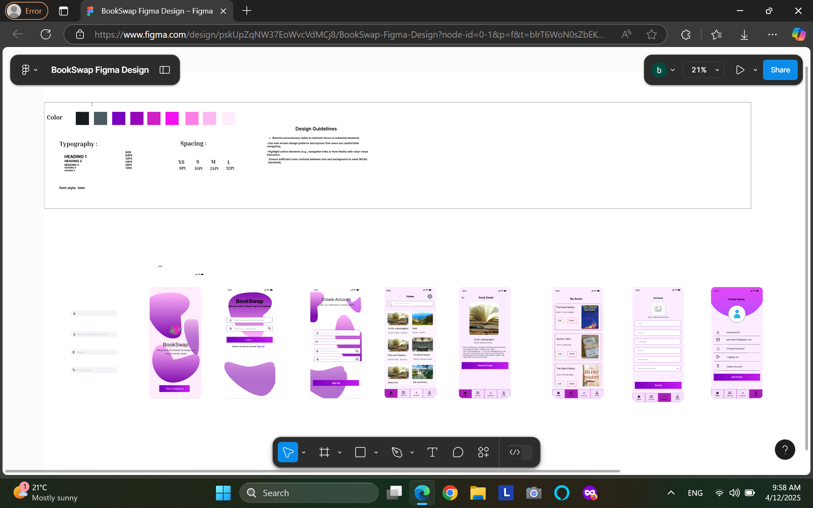

# BookSwap — Book Search Screen Component

A modern Android UI component built with **Jetpack Compose** and **Material 3**, designed for searching, filtering, and browsing books stored in a Room database. This repository contains the source implementation and UI specifications for the `BookSearchScreen` component within the `com.example.bookswap` application package.

---

## 📱 UI Preview



---

## ✨ Features

- **Text Search**: Real-time search query filtering books by title or author name.
- **Genre Filtering**: Filter options including Fiction, Non-Fiction, Mystery, and Science Fiction.
- **Condition Filtering**: Filter options based on book condition (New, Good, Fair, Old).
- **Material 3 Cards & Lazy List**: Scrollable list of books rendered with Material 3 `Card` components, supporting tap navigation to detail views.
- **Asynchronous Data Access**: Asynchronous Room DB queries executed off the main thread using Kotlin Coroutines (`Dispatchers.IO`).

---

## 🛠️ Tech Stack

- **Language**: Kotlin
- **UI Framework**: Jetpack Compose & Material 3 (`androidx.compose.material3`)
- **Database**: Room Persistence Library (`com.example.bookswap.data.AppDatabase`)
- **Asynchronous Processing**: Kotlin Coroutines
- **Navigation**: Jetpack Navigation Compose (`NavController`)

---

## 📁 Repository Structure

```text
.
├── BookSearchScreen.kt       # Jetpack Compose UI composable implementation
├── docs/
│   └── screenshot.png        # UI design screenshot preview
├── .github/
│   └── workflows/
│       └── ci.yml            # CI validation workflow
└── .gitignore                # Android / Kotlin git ignore configuration
```

---

## 🚀 Component Integration

To integrate `BookSearchScreen` into a Compose navigation graph:

```kotlin
NavHost(navController = navController, startDestination = "book_search") {
    composable("book_search") {
        BookSearchScreen(
            navController = navController,
            context = LocalContext.current
        )
    }
    composable("book_details/{bookId}") { backStackEntry ->
        // Book details screen implementation
    }
}
```

---

## 🧪 CI/CD & Workflow

Automated repository verification runs on pushes and pull requests to ensure structure integrity via GitHub Actions (`.github/workflows/ci.yml`).
